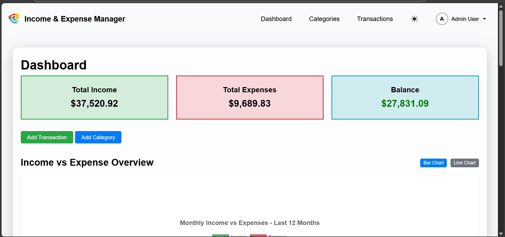
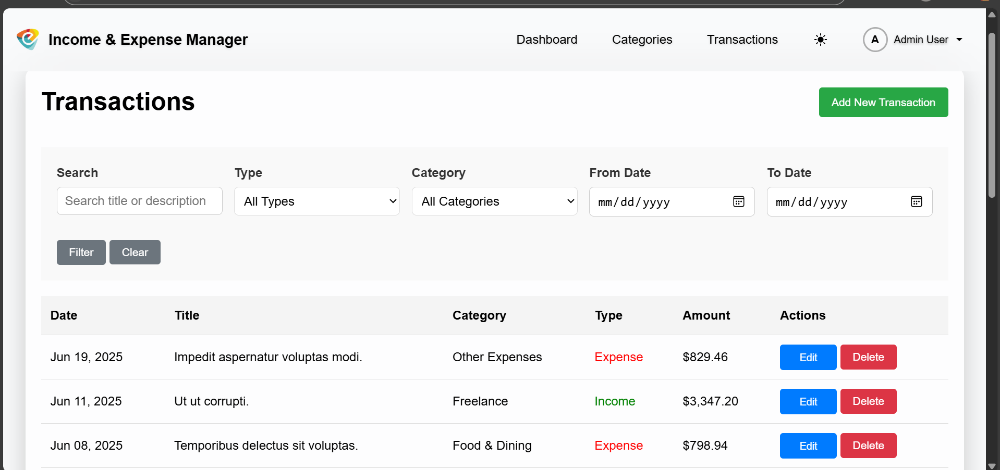
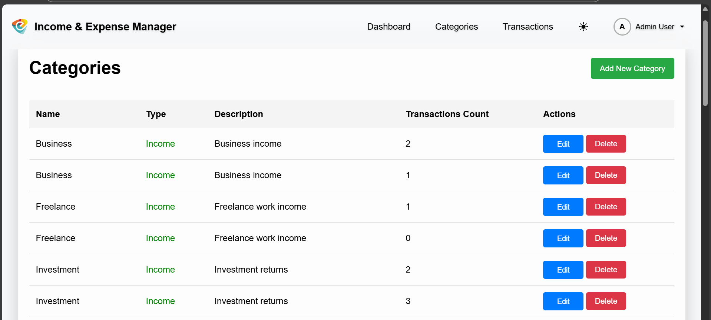
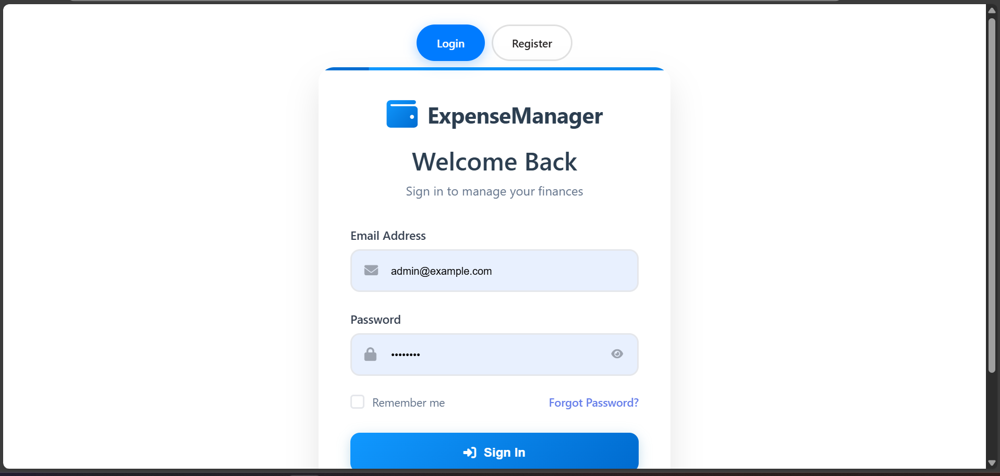
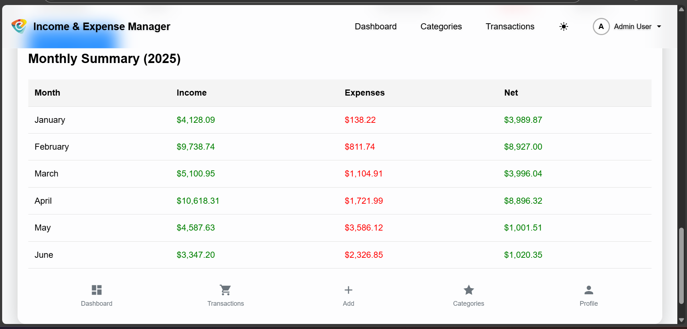
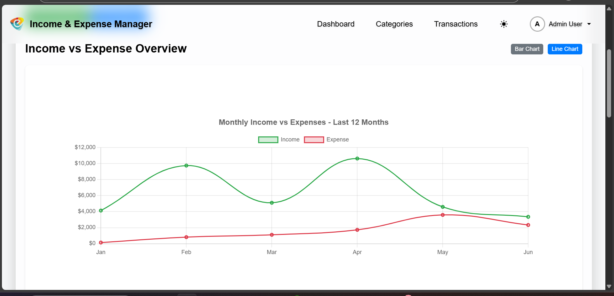

# 💼 Income & Expense Management System

A monolithic Laravel + Vite application for managing personal income and expenses with a modern, responsive UI. Built as part of the Laravel Intern Assessment.

---

## 📷 Screenshots

### 🖥 Dashboard


### 💰 Transactions


### 📂 Category Management


### 🔐 Login Page


### 📊 Reports Page


#### 📊 dark mode


#### 📈 Monthly Chart


---

## 🎥 Demo Video

Watch the walkthrough here: [Demo Video on google drive](https://drive.google.com/file/d/16CeWefrPo-j94SyeNLNKmJBNfVa4ZHV1/view?usp=sharing)

## ⚙️ Features

- User Registration/Login (with password reset)
- Category Management (Income/Expense)
- Transaction Management (CRUD + Filtering)
- Dashboard with Summary Stats & Charts
- Monthly Report & Category Breakdown
- Responsive Design with Bootstrap 5
- Seeders with sample users, categories, and transactions

---

## 🚀 Getting Started

### Prerequisites

- PHP 8.1+
- Composer
- Node.js & NPM
- MySQL or compatible DB
- Laravel CLI

---

### 📥 Installation

```bash
# 01 Clone the repository
git clone https://github.com/your-username/income-expense-system.git
cd income-expense-system

# 02 Install backend dependencies
composer install

# 03 Install frontend assets
npm install

# 04 Create .env file
cp .env.example .env #if not worked, use follwing code. 
copy .env.example .env

# 05 Set your DB credentials in .env
# Then generate app key
php artisan key:generate

# 06 .env file, databse connect
DB_DATABASE=your_database_name #Remember. you should create the databse using mysql(xamp) or ant databse ms and create the databse first
DB_USERNAME=your_username
DB_PASSWORD=your_password

# 07 Run migrations and seeders
php artisan migrate --seed

# 08 Build Frontend Assets
# Development
npm run dev

# Production
npm run build

# 09 Start local server
php artisan serve

#👤 Default Login Credentials
Email: admin@example.com
Password: password

##👨‍💻 Author
= H.M.Madhushanka Herath Kumara 

GitHub: https://github.com/Mherath05
Email: madhushankaherath2@gmail.com

#📞 Support
#If you encounter any issues or have questions, please: 0742113676
